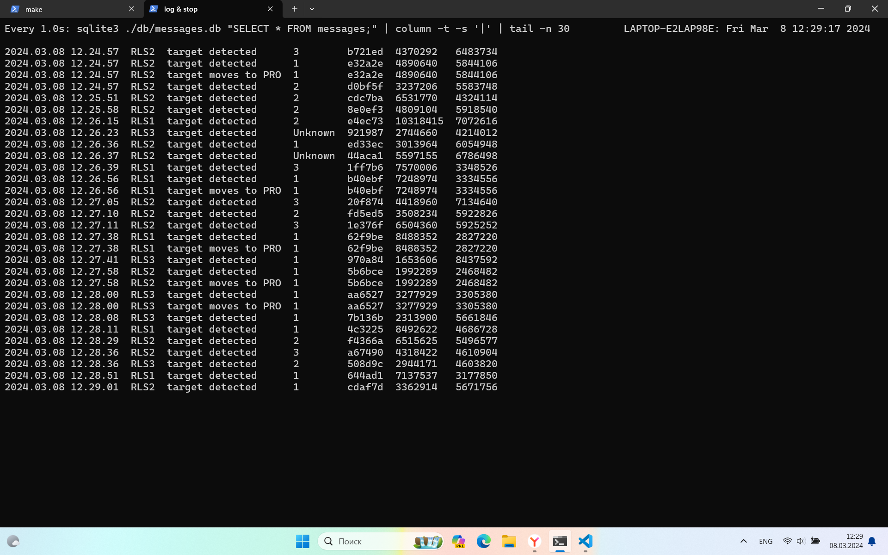
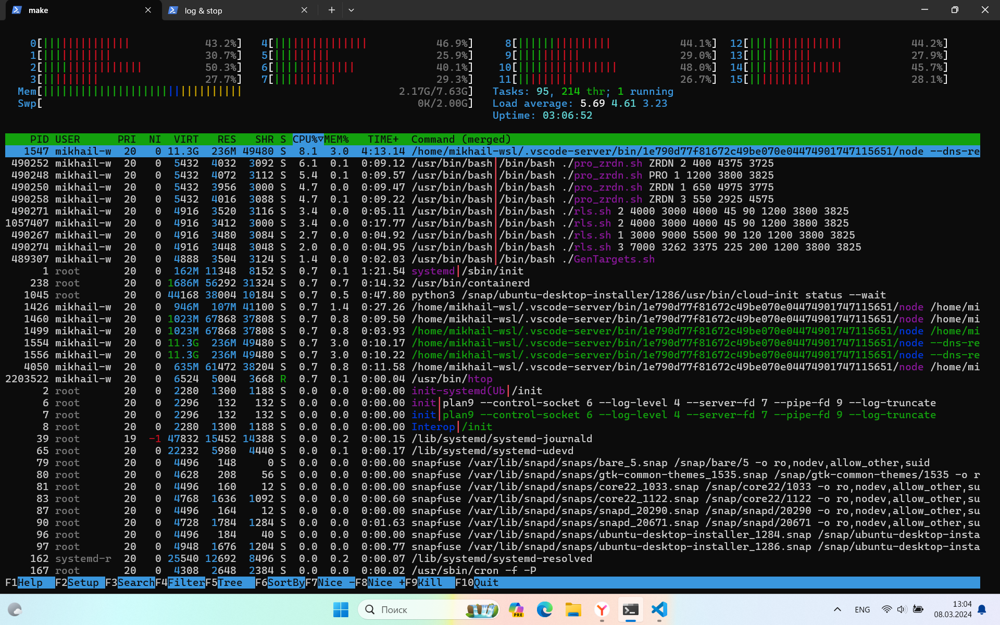
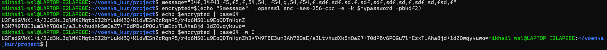

# Задача - создать имитационную модель работы ВКО.
## Вариант 18

### Описание работы

Код самодокументируемый, а также содержатся поясняющие комментарии.

Терминология в коде. 

Под системой (system) подразумевается любая система: РЛС, ПРО или ЗРДН. Цели – target. Запросы для проверки функционирования системы – пинги (ping), ответы от систем – понги (pong). Боеприпасы – ammunition. Функция, которая вызывается при поступлении сигнала от другого процесса – callback.

Взаимодействие модулей

- Системы посылают зашифрованные сообщения до командного пункта через ncat. Командный пункт (сервер) находится в режиме прослушивания.
- Командный пункт пингует или «пополняет» боеприпасы системам через сигналы SIGUSR1 и SIGUSR2 соответственно.

Файлы курсовой работы

- command_post.sh
    - Логика работы командного пункта. Запуск двух процессов. Первый отвечает за обработку входящих сообщений от систем, второй – за рассылку пингов. Процессы общаются через файл (файл-реестр). В этом файле находятся все зарегистрированные системы и их статусы.
    - Все сообщения от систем, кроме специальный, заносятся в БД.
    - Специальное сообщение типа registration. Обработка – это вставка pid, id системы и статуса в файл-реестр.
    - Специальное сообщение типа pong. Обработка – обновление статуса в файле-реестре.
    - Специальное сообщение типа запрос на новые боеприпасы. Обработка – посылка сигнала SIGUSR2 для пополнения боеприпасов.
- pro_zrdn.sh
    - Логика работы ПРО и ЗРДН. Каждая цель может находится в одной из трех стадий.
    - стадия 0 – новая цель
    - стадия 1 - цели, которые были обнаружены и координаты которых уже были записаны в файл FILE_STAGE1
    - стадия 2 - цели, которые были обнаружены повторно, по которым посчитана скорость и выявлен тип (ББ БР, Кр. ракеты, Самолеты).
    - стадия 3 - цели, за которые несет ответственность данная система (например, для ПРО это ББ БР)
- recreate_db.sh
    - Файл для удаления таблицы и создания новой аналогичной.
- rls.sh
    - Логика работы РЛС
    - Функция is_in_coverage_sector определяет, находится ли цель в секторе действия РЛС (через полярные координаты).
    - Функция is_intersected_PRO_zone определяет, летит ли цель по направлению к зоне действия ПРО (через поиск пересечения прямой движения цели с прямой, перпендикулярной ей и проходящей через центр окружности).
- shared.sh
    - Общие константы и функции для файлов rls.sh и pro_zrdn.sh такие как, отправка сообщения через сокет командному пункту, расчет расстояния по двум засечкам координат, определение типа цели по скорости.
    - Этот файл подключается в другие через source
- .env
    - Пароль для симметричного шифрования и «соль» для hash суммы.
- Makefile
    - make run – очистка логов старой сессии, запуск всех скриптов
    - make stop – остановка всех процессов
    - make watch_db – просмотр в режиме реального времени логов в БД

### Логи

> Вывод команды: sqlite3 ./db/messages.db \"SELECT * FROM messages;\" | column -t -s '|'

```
2024.03.14 20.34.42  RLS2   target detected               2  6cab10  4078178  6908960
2024.03.14 20.34.45  RLS1   target detected               3  fb543a  9562334  7007138
2024.03.14 20.34.53  RLS2   pong received
2024.03.14 20.34.53  ZRDN3  pong received
2024.03.14 20.34.53  RLS3   pong received
2024.03.14 20.34.53  ZRDN2  pong received
2024.03.14 20.34.53  RLS1   pong received
2024.03.14 20.34.53  ZRDN1  pong received
2024.03.14 20.34.53  PRO1   pong received
2024.03.14 20.35.04  RLS2   target detected               1  9f0f41  5043590  5773194
2024.03.14 20.35.04  RLS2   target moves to PRO           1  9f0f41  5043590  5773194
2024.03.14 20.35.05  RLS1   target detected               1  bcc374  8615019  5052860
2024.03.14 20.35.05  RLS1   target moves to PRO           1  bcc374  8615019  5052860
2024.03.14 20.35.05  RLS2   target detected               2  daaf59  6787870  5086888
2024.03.14 20.35.11  RLS2   target detected               2  45a276  2859086  2282060
2024.03.14 20.35.11  RLS2   target detected               2  beaa53  6181200  5578934
2024.03.14 20.35.12  PRO1   target detected               1  19138b  3073778  3765942
2024.03.14 20.35.12  PRO1   shot at target                1  19138b  3073778  3765942
2024.03.14 20.35.13  RLS2   pong received
2024.03.14 20.35.13  RLS3   pong received
2024.03.14 20.35.13  PRO1   pong received
2024.03.14 20.35.13  ZRDN1  pong received
2024.03.14 20.35.13  RLS1   pong received
2024.03.14 20.35.13  PRO1   missed target                 1  19138b  3073778  3765942
2024.03.14 20.35.13  PRO1   shot at target                1  19138b  3073778  3765942
2024.03.14 20.35.13  RLS3   target detected               1  19138b  3073778  3765942
2024.03.14 20.35.13  RLS3   target moves to PRO           1  19138b  3073778  3765942
2024.03.14 20.35.13  ZRDN3  pong received
2024.03.14 20.35.13  ZRDN2  pong received
2024.03.14 20.35.14  PRO1   target destroyed              1  19138b
2024.03.14 20.35.17  RLS2   target detected               2  efcc5e  5558276  4263272
2024.03.14 20.35.20  RLS2   target detected               3  dcce6b  6510004  5711640
```

### Вывод.
Была сделана курсовая работ, в ходе которой была разработана имитационная модель работы ВКО. Был изучен синтаксис и многие конструкции командной оболочки bash, на практике закреплены команды и утилиты: ps, kill, grep, ncat, watch, head, sort, cut, tr, trap, tac, sleep, date, source, set, sed, read, openssl, base64, sha256sum, sqlite3, освоены методы межпроцессорного взаимодействия через сокеты и файлы, способы шифрования, кодирования и хэширования, использована файловая БД sqlite и написан Makefile для запуска и остановки всех скриптов, очистки логов. Результаты тестирования корректны, работа выполнена успешно.

<br/>
<br/>
<br/>
<br/>
<br/>

> Замечания


## Проблемы с определением типа объекта по скорости

Если одна координата цели была пропущена, и была посчитана скорость несоседних координат,
то скорость в два раза выше настоящей. 
Следовательно, происходит неправильное определение типа цели
Такое случается, видимо, потому, что скрипт выполняется дольше секунды, за это время успевает сгенерироваться более 30-ти целей 
1. `CLOCK_LOOP=1, CLOCK_MOVE_TARGETS=1, COUNT_TARGETS=45`
- много Unknown
2. `CLOCK_LOOP=0.8, CLOCK_MOVE_TARGETS=1, COUNT_TARGETS=30`
- почти нет Unknown (оптимальный вариант, но можно тюнить)
3. `COUNT_TARGETS=45, TARGET_FILES=$(ls -t $DIR_TARGETS | head -n $COUNT_TARGETS | tac)`
- инвертируем порядок рассмотрения целей (с самых ранних) Но можем захватить уже рассмотренные... тогда скорость = 0
```bash
target_id[a0f718]: (4782315, 6586702) -> (4782315, 6586702)

speed[0]: Unknown

target_id[50f92c]: (1982320, 5333040) -> (1982320, 5333040)

speed[0]: Unknown

target_id[480e70]: (3585188, 6890220) -> (3601564, 6888660)

speed[16450.13604806963291030877]: Unknown
```

```bash
    # еще одна оптимизация, смотрим на координаты целей, которые уже рассматривали
    # совместно с COUNT_TARGETS=45 ни одного Unknown по скорости
    function get_stage() {
        # ... 
        elif grep -q "$target_id" "$FILE_STAGE1"; then
        if grep -q "$target_id,$x,$y" "$FILE_STAGE1"; then
            echo "Erorr: double read"    
        fi
        echo 1
        # ... 
    }

```






## Проблемы с шифрованием

- шифрование и кодирование
- `echo message | aes | base64`
- результирующая строка разбита на несколько строчек (видимо, бинарные данные aes кодируются)
- решение (w - ширина строки): `echo message | aes | base64 -w 0`


