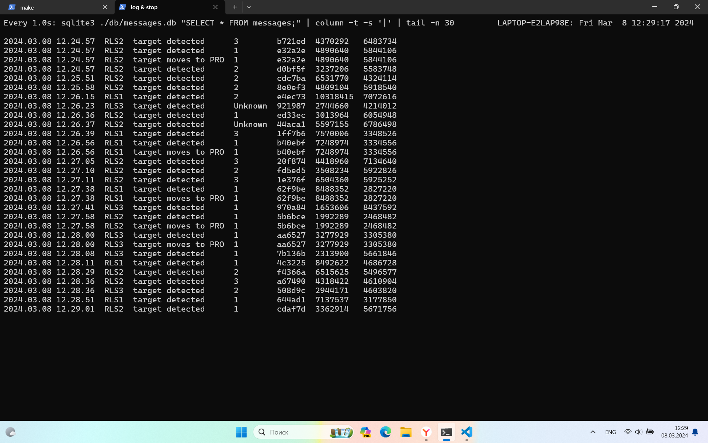

Если одна координата цели была пропущена, и была посчитана скорость несоседних координат,
то скорость в два раза выше настоящей. 
Следовательно, происходит неправильное определение типа цели
Такое случается, видимо, потому, что скрипт выполняется дольше секунды, за это время успевает сгенерироваться более 30-ти целей 
1. `CLOCK_LOOP=1, CLOCK_MOVE_TARGETS=1, COUNT_TARGETS=45`
- много Unknown
2. `CLOCK_LOOP=0.8, CLOCK_MOVE_TARGETS=1, COUNT_TARGETS=30`
- почти нет Unknown (оптимальный вариант, но можно тюнить)
3. `COUNT_TARGETS=45, TARGET_FILES=$(ls -t $DIR_TARGETS | head -n $COUNT_TARGETS | tac)`
- инвертируем порядок рассмотрения целей (с самых ранних) Но можем захватить уже рассмотренные... тогда скорость = 0
```bash
target_id[a0f718]: (4782315, 6586702) -> (4782315, 6586702)

speed[0]: Unknown

target_id[50f92c]: (1982320, 5333040) -> (1982320, 5333040)

speed[0]: Unknown

target_id[480e70]: (3585188, 6890220) -> (3601564, 6888660)

speed[16450.13604806963291030877]: Unknown
```


